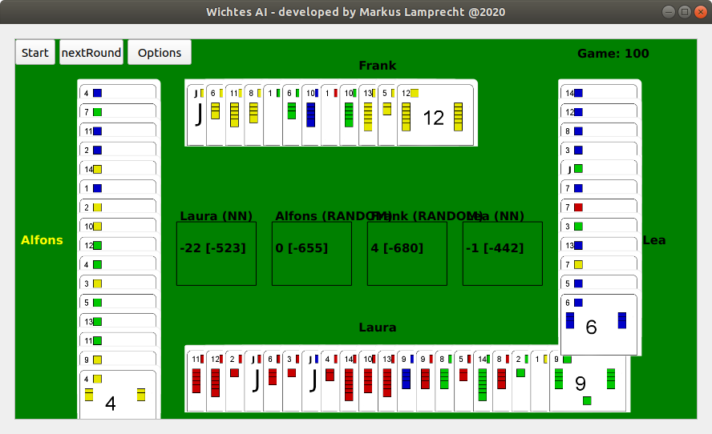
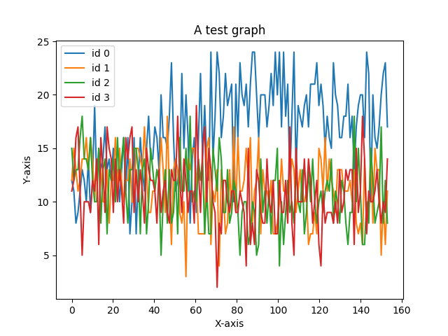

# Windows
Download [mcts_withes_folder.zip](https://drive.google.com/file/d/1UZQyMhH46qzoKJoSYkbsGtTatB2liqXQ/view?usp=sharing) and open the **gui.exe**.



To play a card as HUMAN **double click** the card.

# Options
See file **gui_options.json**
```
{
  "names": ["Laura", "Alfons", "Frank", "Lea"],
  "type": ["NN", "RANDOM", "RANDOM", "NN"],  ###HUMAN, RANDOM, NN, MCTS
  "expo": [500, 500, 500, 500],
  "depths": [300, 300, 300, 300],
  "itera": [5000, 5000, 5000, 5000],
  "faceDown": [false, false, false, false],
  "sleepTime": 0.001,
  "model_path_for_NN": "data/test.pth",
  "nu_games": 100,
  "shifting_phase": 20,
  "mcts_save_actions": false,
  "mcts_actions_path": "data/actions_strong44__mcts.txt",
  "automatic_mode": false,
  "save_game_play": false,
  "game_play_path": "data/game_play.pkl",
  "onnx_path": "data/model_long_training.pth.onnx"  ### model_long_training.pth.onnx, model.pth.onnx, actions_all.pth.onnx
}
```

# Further Information
In here I test Monte Carlo Tree Search (MCTS) for a multi player card game.
Normally MCTS is used for games like chess to select a set of promising options (instead of testing all possible options as in minimax algorithm).
Now in comparison to a card game chess is played in turn. In a card game the winner of the last round is allowed to play the next card.
In here I tested mcts on the multi player card game named [witches](https://www.amazon.de/Unbekannt-4990-AMIGO-Witches/dp/B00J5Z7APO)(rules below) for 2 players (each know all cards).

In the feature I would like to extend this card came for multi player. In this case the game will become an imperfect information game.
Thus there are many many more options the algorithm needs to test! Thereby the waiting time will be much longer!

# Getting started
*	python play.py
* Select Human player by (line 35, 35 in play.py)
```
action = int(input("Action index to play\n"))
#action = my_game.getRandomOption_()
```
* choose different deck size by e.g.: (line 48 in gameClasses.py)
	```
			for val in range(10, 16):# choose different deck size here!
	```
* The smaller the deck the faster the algorithm
* Choose Hyperparameters to speed up the algorithm (in play.py)
	```
	mcts = VanilaMCTS(n_iterations=1500, depth=15, exploration_constant=300, state=state, player=current_player, game=my_game)
	```
	+ n_iterations:
	+ depth: depth level of the tree
	+ exploration_constant: exploit a leaf node more or search for even better options?

# Procedure of Monte Carlo Tree Search
1. create VanilaMCTS object
2. run SOLVE
	* for n_iterations = 50 do:
		* **Selection :** select leaf node which have maximum uct(exploration vs. exploitation) value, out:node to expand, depth (root=0)
		* **Expansion :** create all possible outcomes from leaf node    out: expanded tree
		* **Simulation:** simulate game from child node's state until it reaches the resulting state of the game. out: rewards
		* **Backprob  :**  assign rewards back to the top node!

Tree consists of state([self.players, self.rewards, self.on_table_cards, self.played_cards]), current_player, n, w, q
* n = number of iterations
* w = summed reward at that depth
* q = w/n

The tree looks as follows:
tree = {root_id: {'state': state,
					'player': player,
					'cards_away': [], # this is used for shifting!
					'child': [],
					'parent': None,
					'n': 0,
					'w': 0,
					'q': None}}

# Proposed Procedure:
1. Simulate with Random moves
2. Train a NN (Classifier) with the input of 500 Games
3. Use the trained NN to Simulate and get better actions
4. Repeat Setp 2-3

# Achievements
*	player can be chosen: RANDOM, MCTS, HUMAN, NN(trained NN with MCTS actions)
* 1-15 (15=joker) 60 cards for 2 players (Test2) was done
* included first shifting round (NN plays currently random)

# Reinforcement Learning:
* see commit **is_learning**
* run with  `modules$ python reinforcement_learning.py`
* player 0 is the trained player
* 50 games played
* half of them won by trained player!


# Statistic details / Performance
* Stats with 12 cards of 2,13,14 of Blue Green Red Yellow and 2 Players
	+	Tested with 50 Games, mcts player (always starts) and a **random player**
	+	mcts adjustements: n_iterations=1500, depth=15, exploration_constant=300
	+	Result: total_rewards: [-211. -439.] for game 50 total time: 0:06:52.199611
	+	rewards per game: -4.22, 8,8 per game
* Play 10 games with a **human opponent**
	+	rewards: total_rewards: [-64. -66.] for game 10 total time: 0:10:25.083755
	+ human lost a close match
	+ per game: -6.4, -6.6 per game
* Stats with *60* cards 1-14 15=Joker, and 2 Players (mcts and **random**)
	+ (n_iterations=1500, depth=15, exploration_constant=300
	+	total_rewards: [  13. -266.] for game 10 total time: 1:09:16.619273
* 50 Games, Stats with *60* cards, and **4 Players** (["MCTS", "RANDOM", "MCTS", "RANDOM"]))
	+ n_iterations=50, depth=15, exploration_constant=300
	+ total_rewards: [-106. -517.  -71. -504.] for game 50 total time: 0:11:06.290802

* 50 Game Stats with 4 MCTS Players (Hyper Parameter Search)
	```
	total_rewards: [-305. -258. -241. -169.] for game 50 total time: 1:06:36.474031
	I reset the next game:  50
	The game was started with:
	Number Games  : 50
	Expo Constants: [300, 300, 300, 300]
	depth		 : [15, 15, 15, 15]
	Iteraions     : [100, 100, 100, 100]


	total_rewards: [-235. -243. -263. -270.] for game 50 total time: 4:09:13.044767
	I reset the next game:  50
	The game was started with:
	Number Games  : 50
	Expo Constants: [300, 300, 300, 300]
	depth		 : [15, 15, 15, 15]
	Iteraions     : [1000, 100, 1000, 100]


	total_rewards: [-135. -368. -263. -268.] for game 50 total time: 1:06:20.726154
	I reset the next game:  50
	The game was started with:
	Number Games  : 50
	Expo Constants: [3000, 300, 3000, 300]
	depth		 : [15, 15, 15, 15]
	Iteraions     : [100, 100, 100, 100]

	total_rewards: [-240. -252. -368. -211.] for game 50 total time: 4:13:52.280434
	I reset the next game:  50
	The game was started with:
	Number Games  : 50
	Expo Constants: [3000, 300, 3000, 300]
	depth		 : [15, 15, 15, 15]
	Iteraions     : [100, 1000, 100, 1000]

	total_rewards: [-291. -246. -251. -185.] for game 50 total time: 3:39:30.612880
	Number Games  : 50
	Expo Constants: [400, 400, 400, 400]
	depth		 : [15, 30, 15, 30]
	Iteraions     : [500, 500, 500, 500]

	--> 600, 30, 1000 (should be good adjustements)
	```
* **NN Test** commit: nn_working
  + Test it with ```collect_train_data.py```
	+ a NN with 18000 batches was trained.
	+ 10 Games played timing Performance
	```
	total_rewards: [-70. -34. -84. -58.] for game 10 total time: 0:00:00.706998
	I reset the next game:  10
	The game was started with:
	Number Games  : 10
	Players       : ['NN', 'NN', 'NN', 'NN']
	Expo Constants: [600, 600, 600, 600]
	depth         : [300, 300, 300, 300]
	Iteraions     : [100, 100, 100, 100]
	```
	+ NN vs MCTS:
	+ MCTS is much better (cause it knows all cards of the players)
	+ NN does not know the cards of each player!
	```
	total_rewards: [-267.  -42.  -92. -191.] for game 25 total time: 0:07:33.946991
	I reset the next game:  25
	The game was started with:
	Number Games  : 25
	Players       : ['NN', 'MCTS', 'MCTS', 'NN']
	Expo Constants: [600, 600, 600, 600]
	depth         : [300, 300, 300, 300]
	Iteraions     : [100, 100, 100, 100]
	```
	+ **Problem:** NN did not learn constraint!
	+ In case that it suggest to make an impossible move the first possible move is played!
		```
		total_rewards: [-714. -465. -451. -647.] for game 100 total time: 0:00:07.207669
		I reset the next game:  100
		The game was started with:
		Number Games  : 100
		Players       : ['NN', 'NN', 'NN', 'NN']
		Expo Constants: [600, 600, 600, 600]
		depth         : [300, 300, 300, 300]
		Iterations    : [100, 100, 100, 100]
		Invalid moves tried to play: 297
		```

# Creating an exe
	* convert torch model and params to onnx
	* use pyinstaller (also on ubuntu possible!)
	* in this case exe should be smaller!

# TODO
* Create EXE!
* Have a look at TD-Learning!
* Done: extend for multiplayer [if you know all cards]
* Train a NN:
	* input as 0,1:  played_cards, cards_on_table, card_options
	* output: estimated result value of all players, option to play!
	* Train such a network (to achieve faster moves!) see [here](https://pytorch.org/tutorials/beginner/blitz/cifar10_tutorial.html)
* **Use Google collab to generate data for your NN**
* Read this first UCT: https://hci.iwr.uni-heidelberg.de/system/files/private/downloads/297868474/report_robert-klassert.pdf
* Test this one: multiprocessing.Pool here: https://wiseodd.github.io/techblog/2016/06/13/parallel-monte-carlo/
* See also this good explanation: https://pdfs.semanticscholar.org/fe90/c1f9955ba1f06f5ef26bde100bcc5c7a3327.pdf
* Or use CUDA or parallel mcts!

* Do Graphics pygame
* Extend for multiplayer (you do not know the options of the other players -> imperfect information game!)
* do tests for evaluation on hyperparams (n_iter, exploration_const, depth)
* Change depth level (such that only x turns are calculated in advance not until the game is finished!)

# Links:
*	https://en.wikipedia.org/wiki/Monte_Carlo_tree_search
*	https://github.com/hayoung-kim/mcts-tic-tac-
* https://www.youtube.com/watch?v=UXW2yZndl7U

# Rules of witches:
*	Aim:	Have a minimum of minus Points!
*	60 	   Cards(4xJoker, 1-14 in Yellow, Green, Red, Blue)
*	Red    Cards give -1 Point (except Red 11)
*	Blue   Cards do nothing    (except Blue 11 if you have it in your offhand deletes green 11 and green 12 if you have it in your offhand as well)
*	Green  Cards do nothing	   (except Green 11 -5 and Green 12 -10 Points)
* Yellow Cards do nothing    (except Yellow 11 +5)
*	A joker can be placed anytime (you do not have to give the same color as the first player)
* If you have no joker and you are not the first player, you have to play the same color as the first player.
* The winner of one round (highest card value) has to start with the next round
* If only Jokers are played the first one wins this round.
* Note: Number 15 is a Joker (in the code)

# Further Notes:
Problem: mcts geht nicht fuer imperfect information games oder sprich sobald mehr als 2 Personen dabei sind explodiert alles?! Bspw. wenn jeder nur 3 Karten bekommt.

Für 4 Spieler und 3 Karten
Müsste man 3!=6 MCTS lernen lassen mit:
1. Zug max 81 mögliche Zustände
Erster Spieler hat 3 Möglichkeiten
Zweiter Spieler 9 mögliche Zustände
Dritter Spieler 27 mögliche Zustände
Vierter Spieler 81 mögliche Zustände

2. Zug für jeden der 81 möglichen Zustände
- wenn spieler 1 gewinnt:
	dann hat erster Spieler 2 möglichkeiten 81*2 zustände
	dann hat zweiter Spieler 2 möglichkeiten 81*4 zustände
	dann hat dritter Spieler 2 möglichkeiten 81*8
	dann hat vierter Spieler 2 möglichkeiten 81*16
das ganze nochmal mal 4 wenn ein anderer Spieler gewinnt also 5184 Zustände.

3. Zug:


Other Card Games:
+ Hearts: http://fse.studenttheses.ub.rug.nl/15440/1/Bachelor_Thesis_-_Maxiem_Wagen_1.pdf
+ RI Book: https://web.stanford.edu/class/psych209/Readings/SuttonBartoIPRLBook2ndEd.pdf


# Example tree
```
{(0,): {'state': [[<gameClasses.player object at 0x7f84940f26d8>, <gameClasses.player object at 0x7f84940fe6d8>, <gameClasses.player object at 0x7f84940fe710>, <gameClasses.player object at 0x7f84940fe748>], array([0., 0., 0., 0.]), [3 of B, 13 of B, 6 of B, J of Y], [3 of B, 13 of B, 6 of B, J of Y, 9 of Y, 1 of Y, 5 of Y], 20, array([0., 0., 0., 0.])], 'player': 0, 'cards_away': [], 'child': [0, 1, 2, 3, 4, 5, 6, 7, 8, 9, 10, 11, 12, 13, 14], 'parent': None, 'n': 3, 'w': 0.0, 'q': 0.0},

(0, 0): {'state': [[<gameClasses.player object at 0x7f8494104588>, <gameClasses.player object at 0x7f8494104c88>, <gameClasses.player object at 0x7f84941123c8>, <gameClasses.player object at 0x7f8494112ac8>], array([0., 0., 0., 0.]), [3 of B], [3 of B], 20, array([0., 0., 0., 0.])], 'player': 1, 'cards_away': 0, 'child': [0, 1, 2, 3, 4, 10], 'parent': (0,), 'n': 1, 'w': 4.0, 'q': 4.0},

(0, 1): {'state': [[<gameClasses.player object at 0x7f8494115208>, <gameClasses.player object at 0x7f8494115908>, <gameClasses.player object at 0x7f8494119048>, <gameClasses.player object at 0x7f8494119748>], array([0., 0., 0., 0.]), [9 of B], [9 of B], 20, array([0., 0., 0., 0.])], 'player': 1, 'cards_away': 1, 'child': [0, 1, 2, 3, 4, 10], 'parent': (0,), 'n': 1, 'w': 4.0, 'q': 4.0},

(0, 2): {'state': [[<gameClasses.player object at 0x7f8494119e48>, <gameClasses.player object at 0x7f8494113588>, <gameClasses.player object at 0x7f8494113c88>, <gameClasses.player object at 0x7f847844b3c8>], array([0., 0., 0., 0.]), [10 of B], [10 of B], 20, array([0., 0., 0., 0.])], 'player': 1, 'cards_away': 2, 'child': [], 'parent': (0,), 'n': 0, 'w': 0, 'q': 0},

(0, 3): {'state': [[<gameClasses.player object at 0x7f847844bac8>, <gameClasses.player object at 0x7f849411b208>, <gameClasses.player object at 0x7f849411b908>, <gameClasses.player object at 0x7f847844f048>], array([0., 0., 0., 0.]), [>11< of B], [>11< of B], 20, array([0., 0., 0., 0.])], 'player': 1, 'cards_away': 3, 'child': [], 'parent': (0,), 'n': 0, 'w': 0, 'q': 0},

(0, 4): {'state': [[<gameClasses.player object at 0x7f847844f748>, <gameClasses.player object at 0x7f847844fe48>, <gameClasses.player object at 0x7f8478453588>, <gameClasses.player object at 0x7f8478453c88>], array([0., 0., 0., 0.]), [12 of B], [12 of B], 20, array([0., 0., 0., 0.])], 'player': 1, 'cards_away': 4, 'child': [], 'parent': (0,), 'n': 0, 'w': 0, 'q': 0}, (0, 5): {'state': [[<gameClasses.player object at 0x7f84784573c8>, <gameClasses.player object at 0x7f8478457ac8>, <gameClasses.player object at 0x7f8478458208>, <gameClasses.player object at 0x7f8478458908>], array([0., 0., 0., 0.]), [J of B], [J of B], 20, array([0., 0., 0., 0.])], 'player': 1, 'cards_away': 5, 'child': [], 'parent': (0,), 'n': 0, 'w': 0, 'q': 0}, (0, 6): {'state': [[<gameClasses.player object at 0x7f8478452048>, <gameClasses.player object at 0x7f8478452748>, <gameClasses.player object at 0x7f8478452e48>, <gameClasses.player object at 0x7f847845c588>], array([0., 0., 0., 0.]), [8 of G], [8 of G], 20, array([0., 0., 0., 0.])], 'player': 1, 'cards_away': 6, 'child': [], 'parent': (0,), 'n': 1, 'w': -8.0, 'q': -8.0}, (0, 7): {'state': [[<gameClasses.player object at 0x7f847845cc88>, <gameClasses.player object at 0x7f847845b3c8>, <gameClasses.player object at 0x7f847845bac8>, <gameClasses.player object at 0x7f8478461208>], array([0., 0., 0., 0.]), [10 of G], [10 of G], 20, array([0., 0., 0., 0.])], 'player': 1, 'cards_away': 7, 'child': [], 'parent': (0,), 'n': 0, 'w': 0, 'q': 0}, (0, 8): {'state': [[<gameClasses.player object at 0x7f8478461908>, <gameClasses.player object at 0x7f8478463048>, <gameClasses.player object at 0x7f8478463748>, <gameClasses.player object at 0x7f8478463e48>], array([0., 0., 0., 0.]), [>11< of G], [>11< of G], 20, array([0., 0., 0., 0.])], 'player': 1, 'cards_away': 8, 'child': [], 'parent': (0,), 'n': 0, 'w': 0, 'q': 0}, (0, 9): {'state': [[<gameClasses.player object at 0x7f8478465588>, <gameClasses.player object at 0x7f8478465c88>, <gameClasses.player object at 0x7f84784683c8>, <gameClasses.player object at 0x7f8478468ac8>], array([0., 0., 0., 0.]), [14 of G], [14 of G], 20, array([0., 0., 0., 0.])], 'player': 1, 'cards_away': 9, 'child': [], 'parent': (0,), 'n': 0, 'w': 0, 'q': 0}, (0, 10): {'state': [[<gameClasses.player object at 0x7f847846a208>, <gameClasses.player object at 0x7f847846a908>, <gameClasses.player object at 0x7f847846b048>, <gameClasses.player object at 0x7f847846b748>], array([0., 0., 0., 0.]), [1 of R], [1 of R], 20, array([0., 0., 0., 0.])], 'player': 1, 'cards_away': 10, 'child': [], 'parent': (0,), 'n': 0, 'w': 0, 'q': 0}, (0, 11): {'state': [[<gameClasses.player object at 0x7f847846be48>, <gameClasses.player object at 0x7f847845e588>, <gameClasses.player object at 0x7f847845ec88>, <gameClasses.player object at 0x7f84784703c8>], array([0., 0., 0., 0.]), [2 of R], [2 of R], 20, array([0., 0., 0., 0.])], 'player': 1, 'cards_away': 11, 'child': [], 'parent': (0,), 'n': 0, 'w': 0, 'q': 0}, (0, 12): {'state': [[<gameClasses.player object at 0x7f8478470ac8>, <gameClasses.player object at 0x7f8478473208>, <gameClasses.player object at 0x7f8478473908>, <gameClasses.player object at 0x7f8478476048>], array([0., 0., 0., 0.]), [4 of R], [4 of R], 20, array([0., 0., 0., 0.])], 'player': 1, 'cards_away': 12, 'child': [], 'parent': (0,), 'n': 0, 'w': 0, 'q': 0},

(0, 13): {'state': [[<gameClasses.player object at 0x7f8478476748>, <gameClasses.player object at 0x7f8478476e48>, <gameClasses.player object at 0x7f8478477588>, <gameClasses.player object at 0x7f8478477c88>], array([0., 0., 0., 0.]), [13 of Y], [13 of Y], 20, array([0., 0., 0., 0.])], 'player': 1, 'cards_away': 13, 'child': [], 'parent': (0,), 'n': 0, 'w': 0, 'q': 0}, (0, 14): {'state': [[<gameClasses.player object at 0x7f84784793c8>, <gameClasses.player object at 0x7f8478479ac8>,

<gameClasses.player object at 0x7f847847b208>, <gameClasses.player object at 0x7f847847b908>], array([0., 0., 0., 0.]), [14 of Y], [14 of Y], 20, array([0., 0., 0., 0.])], 'player': 1, 'cards_away': 14, 'child': [], 'parent': (0,), 'n': 0, 'w': 0, 'q': 0},

(0, 0, 0): {'state': [[<gameClasses.player object at 0x7f847847ef98>, <gameClasses.player object at 0x7f847847e6a0>, <gameClasses.player object at 0x7f8478480cf8>, <gameClasses.player object at 0x7f8478481358>], array([0., 0., 0., 0.]), [3 of B, 1 of B], [3 of B, 1 of B], 20, array([0., 0., 0., 0.])], 'player': 2, 'cards_away': 0, 'child': [], 'parent': (0, 0), 'n': 0, 'w': 0, 'q': 0},
(0, 0, 1): {'state': [[<gameClasses.player object at 0x7f8478481ac8>, <gameClasses.player object at 0x7f8478486198>, <gameClasses.player object at 0x7f8478486898>, <gameClasses.player object at 0x7f8478486f98>], array([0., 0., 0., 0.]), [3 of B, 2 of B], [3 of B, 2 of B], 20, array([0., 0., 0., 0.])], 'player': 2, 'cards_away': 1, 'child': [], 'parent': (0, 0), 'n': 1, 'w': 4.0, 'q': 4.0},
(0, 0, 2): {'state': [[<gameClasses.player object at 0x7f8478485748>, <gameClasses.player object at 0x7f8478485dd8>, <gameClasses.player object at 0x7f847840a518>, <gameClasses.player object at 0x7f847840ac18>], array([0., 0., 0., 0.]), [3 of B, 7 of B], [3 of B, 7 of B], 20, array([0., 0., 0., 0.])], 'player': 2, 'cards_away': 2, 'child': [], 'parent': (0, 0), 'n': 0, 'w': 0, 'q': 0},
(0, 0, 3): {'state': [[<gameClasses.player object at 0x7f847840c3c8>, <gameClasses.player object at 0x7f847840ca58>, <gameClasses.player object at 0x7f847840e198>, <gameClasses.player object at 0x7f847840e898>], array([0., 0., 0., 0.]), [3 of B, 8 of B], [3 of B, 8 of B], 20, array([0., 0., 0., 0.])], 'player': 2, 'cards_away': 3, 'child': [], 'parent': (0, 0), 'n': 0, 'w': 0, 'q': 0},
(0, 0, 4): {'state': [[<gameClasses.player object at 0x7f8478412048>, <gameClasses.player object at 0x7f84784126d8>, <gameClasses.player object at 0x7f8478412dd8>, <gameClasses.player object at 0x7f8478410518>], array([0., 0., 0., 0.]), [3 of B, 13 of B], [3 of B, 13 of B], 20, array([0., 0., 0., 0.])], 'player': 2, 'cards_away': 4, 'child': [], 'parent': (0, 0), 'n': 0, 'w': 0, 'q': 0},
(0, 0, 10): {'state': [[<gameClasses.player object at 0x7f8478410c88>, <gameClasses.player object at 0x7f8478416358>, <gameClasses.player object at 0x7f8478416a58>, <gameClasses.player object at 0x7f8478419198>], array([0., 0., 0., 0.]), [3 of B, J of R], [3 of B, J of R], 20, array([0., 0., 0., 0.])], 'player': 2, 'cards_away': 10, 'child': [], 'parent': (0, 0), 'n': 0, 'w': 0, 'q': 0},

(0, 1, 0): {'state': [[<gameClasses.player object at 0x7f8478419eb8>, <gameClasses.player object at 0x7f847841b748>, <gameClasses.player object at 0x7f847841c550>, <gameClasses.player object at 0x7f847841cc18>], array([0., 0., 0., 0.]), [9 of B, 1 of B], [9 of B, 1 of B], 20, array([0., 0., 0., 0.])], 'player': 2, 'cards_away': 0, 'child': [], 'parent': (0, 1), 'n': 0, 'w': 0, 'q': 0},
(0, 1, 1): {'state': [[<gameClasses.player object at 0x7f847841d3c8>, <gameClasses.player object at 0x7f847841da58>, <gameClasses.player object at 0x7f8478422198>, <gameClasses.player object at 0x7f8478422898>], array([0., 0., 0., 0.]), [9 of B, 2 of B], [9 of B, 2 of B], 20, array([0., 0., 0., 0.])], 'player': 2, 'cards_away': 1, 'child': [], 'parent': (0, 1), 'n': 0, 'w': 0, 'q': 0},
(0, 1, 2): {'state': [[<gameClasses.player object at 0x7f8478424048>, <gameClasses.player object at 0x7f84784246d8>, <gameClasses.player object at 0x7f8478424dd8>, <gameClasses.player object at 0x7f8478423518>], array([0., 0., 0., 0.]), [9 of B, 7 of B], [9 of B, 7 of B], 20, array([0., 0., 0., 0.])], 'player': 2, 'cards_away': 2, 'child': [], 'parent': (0, 1), 'n': 0, 'w': 0, 'q': 0},
(0, 1, 3): {'state': [[<gameClasses.player object at 0x7f8478423c88>, <gameClasses.player object at 0x7f8478427358>, <gameClasses.player object at 0x7f8478427a58>, <gameClasses.player object at 0x7f8478429198>], array([0., 0., 0., 0.]), [9 of B, 8 of B], [9 of B, 8 of B], 20, array([0., 0., 0., 0.])], 'player': 2, 'cards_away': 3, 'child': [], 'parent': (0, 1), 'n': 0, 'w': 0, 'q': 0},
(0, 1, 4): {'state': [[<gameClasses.player object at 0x7f8478429908>, <gameClasses.player object at 0x7f8478429f98>, <gameClasses.player object at 0x7f847842b6d8>, <gameClasses.player object at 0x7f847842bdd8>], array([0., 0., 0., 0.]), [9 of B, 13 of B], [9 of B, 13 of B], 20, array([0., 0., 0., 0.])], 'player': 2, 'cards_away': 4, 'child': [], 'parent': (0, 1), 'n': 0, 'w': 0, 'q': 0},
(0, 1, 10): {'state': [[<gameClasses.player object at 0x7f847842d588>, <gameClasses.player object at 0x7f847842dc18>, <gameClasses.player object at 0x7f8478430358>, <gameClasses.player object at 0x7f8478430a58>], array([0., 0., 0., 0.]), [9 of B, J of R], [9 of B, J of R], 20, array([0., 0., 0., 0.])], 'player': 2, 'cards_away': 10, 'child': [], 'parent': (0, 1), 'n': 1, 'w': 4.0, 'q': 4.0}}
```


# Output of **train.py** commit: *onnx_working*:
```
Read in samples:	18859
One sample:
[[0, 0, 1, 0, 0, 0, 1, 0, 0, 0, 0, 0, 0, 0, 0, 0, 0, 0, 0, 1, 0, 0, 0, 0, 0, 0, 0, 0, 1, 1, 1, 0, 0, 0, 0, 0, 0, 0, 1, 1, 0, 1, 0, 1, 0, 0, 0, 1, 1, 0, 1, 1, 0, 0, 0, 0, 0, 1, 0, 0, 0, 0, 0, 0, 0, 0, 0, 0, 0, 0, 0, 0, 0, 0, 0, 0, 0, 0, 0, 0, 0, 0, 0, 0, 0, 0, 0, 0, 0, 0, 0, 0, 0, 0, 0, 0, 0, 0, 0, 0, 0, 0, 0, 0, 0, 0, 0, 0, 0, 0, 0, 0, 0, 0, 0, 0, 0, 0, 0, 0, 0, 0, 0, 0, 0, 0, 0, 0, 0, 0, 0, 0, 0, 0, 0, 0, 0, 0, 0, 0, 0, 0, 0, 0, 0, 0, 0, 0, 0, 0, 0, 0, 0, 0, 0, 0, 0, 0, 0, 0, 0, 0, 0, 0, 0, 0, 0, 0, 0, 0, 0, 0, 0, 0, 0, 0, 0, 0, 0, 0], 57]
[1,   100] loss: 387.769
[1,   200] loss: 337.980
[1,   300] loss: 315.572
[1,   400] loss: 294.084
[1,   500] loss: 275.887
[1,   600] loss: 270.683
[1,   700] loss: 260.207
[1,   800] loss: 253.414
[1,   900] loss: 249.442
[1,  1000] loss: 238.414
[1,  1100] loss: 232.762
[1,  1200] loss: 229.282
[1,  1300] loss: 230.973
[1,  1400] loss: 226.616
[1,  1500] loss: 220.025
[1,  1600] loss: 211.258
[1,  1700] loss: 216.079
[1,  1800] loss: 206.454
tensor([1., 1., 0., 0., 0., 0., 1., 0., 0., 1., 0., 0., 0., 0., 0., 0., 0., 1.,
        0., 0., 0., 0., 0., 1., 0., 1., 0., 0., 0., 0., 1., 0., 0., 0., 0., 0.,
        1., 0., 0., 1., 0., 0., 0., 0., 0., 0., 0., 0., 0., 0., 0., 0., 0., 0.,
        0., 0., 0., 0., 0., 0., 0., 0., 0., 0., 0., 0., 0., 0., 0., 0., 0., 0.,
        0., 0., 1., 0., 0., 0., 0., 0., 0., 0., 0., 0., 0., 0., 0., 0., 0., 0.,
        0., 0., 0., 0., 0., 0., 0., 0., 0., 0., 0., 0., 0., 0., 0., 0., 0., 0.,
        1., 1., 0., 0., 0., 0., 0., 0., 0., 0., 0., 0., 0., 0., 0., 0., 0., 0.,
        0., 1., 1., 0., 1., 0., 0., 1., 1., 0., 0., 0., 0., 0., 0., 0., 0., 0.,
        0., 0., 0., 0., 0., 0., 0., 0., 1., 0., 0., 0., 0., 0., 1., 0., 1., 1.,
        1., 1., 1., 0., 1., 1., 1., 1., 1., 0., 0., 0., 1., 1., 1., 1., 1., 1.])
Finished Training in:	0:00:02.312103
I saved your model to:	data/model.pth
I now save your onnx model with parameters!
I will now check your onnx model using onnx
<onnxruntime.capi.session.InferenceSession object at 0x7f9873930da0>
[<onnxruntime.capi.onnxruntime_pybind11_state.NodeArg object at 0x7f98691a5bc8>]
input.1
I will now test your model!
[array([ -3.2607808,  -3.457503 ,  -7.639492 ,  -7.3476543,  -5.508501 ,
        -6.5215015,  -0.8601465,  -6.4172306,  -7.440096 ,  -2.6843185,
        -8.942799 ,  -5.1809483,  -4.9209766,  -7.719907 ,  -9.005304 ,
        -8.302288 ,  -7.1568375,  -3.3195906,  -8.95669  ,  -7.119462 ,
        -7.390052 ,  -7.781508 ,  -6.76344  ,  -3.5796459,  -6.1413436,
        -2.9167445,  -4.15365  ,  -8.423178 ,  -6.104857 ,  -5.539221 ,
        -4.0965657,  -6.5832458, -11.25923  ,  -5.9366293,  -8.30854  ,
        -8.426708 ,  -2.1296508,  -8.785681 ,  -9.701228 ,  -2.1758657,
        -7.4398003,  -7.3487854,  -7.1235924,  -6.95055  ,  -6.9943233,
        -6.5696526, -11.682266 , -11.028063 , -10.226396 , -10.814424 ,
       -10.284258 ,  -5.9688644,  -5.6975207,  -6.2563257,  -9.259622 ,
        -6.365409 ,  -7.2721806,  -8.853003 , -10.176397 , -10.104825 ],
      dtype=float32)]
train.py:137: UserWarning: To copy construct from a tensor, it is recommended to use sourceTensor.clone().detach() or sourceTensor.clone().detach().requires_grad_(True), rather than torch.tensor(sourceTensor).
  input_vector = torch.tensor(input_vector[0]).float()
Outputs: using pytorch:
tensor([ -3.2608,  -3.4575,  -7.6395,  -7.3477,  -5.5085,  -6.5215,  -0.8601,
         -6.4172,  -7.4401,  -2.6843,  -8.9428,  -5.1809,  -4.9210,  -7.7199,
         -9.0053,  -8.3023,  -7.1568,  -3.3196,  -8.9567,  -7.1195,  -7.3901,
         -7.7815,  -6.7634,  -3.5796,  -6.1413,  -2.9167,  -4.1536,  -8.4232,
         -6.1049,  -5.5392,  -4.0966,  -6.5832, -11.2592,  -5.9366,  -8.3085,
         -8.4267,  -2.1297,  -8.7857,  -9.7012,  -2.1759,  -7.4398,  -7.3488,
         -7.1236,  -6.9506,  -6.9943,  -6.5697, -11.6823, -11.0281, -10.2264,
        -10.8144, -10.2843,  -5.9689,  -5.6975,  -6.2563,  -9.2596,  -6.3654,
         -7.2722,  -8.8530, -10.1764, -10.1048], grad_fn=<LogSoftmaxBackward>)
```


## Started **modules.reinforcement_learning.py** commit "beginning_reinforce"
* why not learning anything??
* tested with self.rewards, and discountedRewards
* change lr, momentum, gamma (for rewards)
* tested with -1*loss (no effect)
* how does the learning work in general?, when initializing the network params lost?
* see other reinforce examples:
  * Read [here](https://towardsdatascience.com/learning-reinforcement-learning-reinforce-with-pytorch-5e8ad7fc7da0) for a basic understanding!
    * The output of a DQN is going to be a vector of value estimates while the output of the policy gradient is going to be a probability distribution over actions.
  * https://github.com/pytorch/examples/blob/master/reinforcement_learning/reinforce.py
* Using a different discount function does not work as well!
* use only positive rewards! klappt auch nicht!!!
* Try using **another network!**
* wie ...
[0.8076923076923077, 0.8076923076923077, 0.8076923076923077, 0.8076923076923077, 0.8076923076923077, 0.8076923076923077, 0.6923076923076923, 0.8076923076923077, 0.8076923076923077, 0.8076923076923077, 0.8076923076923077, 0.8076923076923077, 0.8076923076923077, 0.8076923076923077, 0.8076923076923077]
[tensor(-1.4820, grad_fn=<SqueezeBackward1>), tensor(-2.7397, grad_fn=<SqueezeBackward1>), tensor(-1.5664, grad_fn=<SqueezeBackward1>), tensor(-1.0297, grad_fn=<SqueezeBackward1>), tensor(-2.2039, grad_fn=<SqueezeBackward1>), tensor(-2.0374, grad_fn=<SqueezeBackward1>), tensor(-0.8260, grad_fn=<SqueezeBackward1>), tensor(-1.8811, grad_fn=<SqueezeBackward1>), tensor(-0.8654, grad_fn=<SqueezeBackward1>), tensor(-0.4187, grad_fn=<SqueezeBackward1>), tensor(-0.6031, grad_fn=<SqueezeBackward1>), tensor(-1.4244, grad_fn=<SqueezeBackward1>), tensor(-0.8793, grad_fn=<SqueezeBackward1>), tensor(-0.8207, grad_fn=<SqueezeBackward1>), tensor(-1.1921e-07, grad_fn=<SqueezeBackward1>)]


[0.0, 0.0, 0.0, 0.0, 0.0, 0.0, 0.0, 0.0, 0.0, 0.0, 0.0, 0.0, -0.14285714285714285, -0.09523809523809523, -0.047619047619047616]
vorher:
[tensor([-2.6326], grad_fn=<SqueezeBackward1>), tensor([-1.0892], grad_fn=<SqueezeBackward1>), tensor([-2.5067], grad_fn=<SqueezeBackward1>), tensor([-2.5980], grad_fn=<SqueezeBackward1>), tensor([-2.2930], grad_fn=<SqueezeBackward1>), tensor([-2.2207], grad_fn=<SqueezeBackward1>), tensor([-2.1485], grad_fn=<SqueezeBackward1>), tensor([-2.0980], grad_fn=<SqueezeBackward1>), tensor([-0.6237], grad_fn=<SqueezeBackward1>), tensor([-1.1372], grad_fn=<SqueezeBackward1>), tensor([-0.7629], grad_fn=<SqueezeBackward1>), tensor([-1.1921e-07], grad_fn=<SqueezeBackward1>), tensor([-1.1921e-07], grad_fn=<SqueezeBackward1>), tensor([-0.8331], grad_fn=<SqueezeBackward1>), tensor([-1.1921e-07], grad_fn=<SqueezeBackward1>)]
nachher:
tensor([-2.6326e+00, -1.0892e+00, -2.5067e+00, -2.5980e+00, -2.2930e+00,
        -2.2207e+00, -2.1485e+00, -2.0980e+00, -6.2368e-01, -1.1372e+00,
        -7.6289e-01, -1.1921e-07, -1.1921e-07, -8.3311e-01, -1.1921e-07],
       grad_fn=<CatBackward>)

* Does not work as well!!!

* Question on forum
  * How do I know that my algorithm learns something?
  * How to setup the network?
  * What am I missing?
  * What shape should losses have (15x15 matrix?)
  * see [here](https://discuss.pytorch.org/t/reinforce-for-a-multiplayer-game/73207)
  * geht hiermit noch aktuell am besten:         self.optimizer = optim.SGD(self.parameters(), lr=0.1)
  * bestes ergebnis: game finished with::: [-295. -663. -729. -716.]
  * **Should I collect batches????!!!**
  * Problem ist dass  
  * invalid multinomial distribution (encountering probability entry < 0)
  * # clipping to prevent nans:
    # see https://discuss.pytorch.org/t/proper-way-to-do-gradient-clipping/191/6
    torch.nn.utils.clip_grad_norm_(self.parameters(), 5)

* Check Game Logic:
  * ai player plays valid cards!
